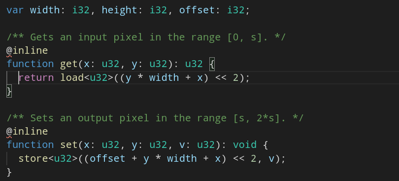
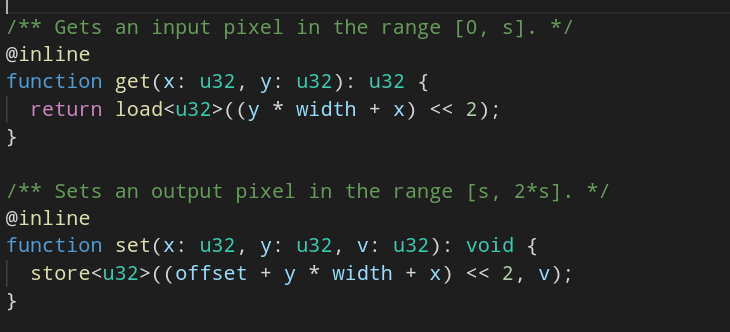

# AssemblyScript Language Server Plugin

Adds basic language support for AssemblyScript by hooking into the TypeScript Language Server via plugin. [See docs here](https://github.com/microsoft/TypeScript/wiki/Writing-a-Language-Service-Plugin).

## Before



## After



## Usage

Install the plugin: `npm i -D assemblyscript-language-plugin`.

Add the plugin to your `tsconfig.json` under `compilerOptions.plugins`:

```json
{
  "extends": "assemblyscript/std/assembly.json",
  "compilerOptions": {
    "plugins": [{ "name": "assemblyscript-language-plugin" }]
  },
  "include": ["./**/*"]
}
```
